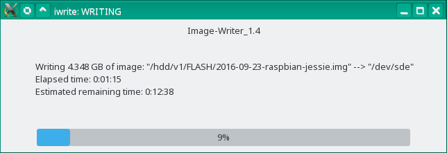
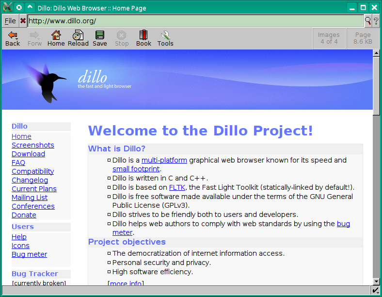
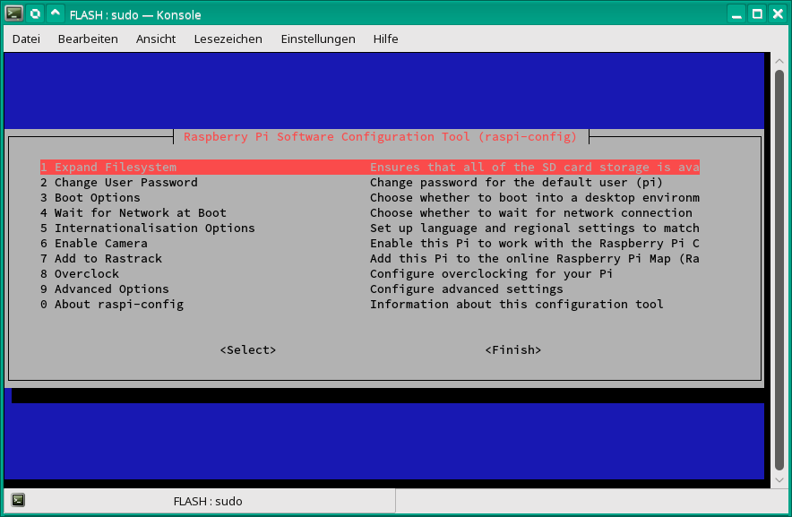
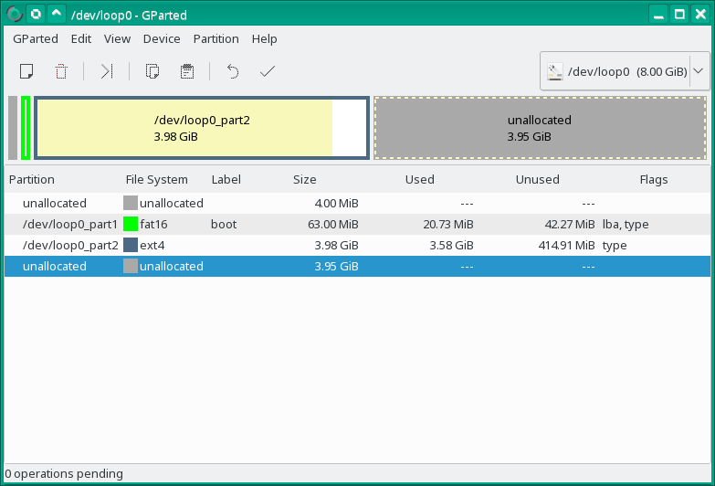

Linux tools for manipulating image files and writing or reading to and from flash-memory e.g. SD-cards
======================================================================================================

- Suitable for preparing image-files for raspberry pi, beagle-bone and so on...
- Thru automatically querying a permission-file in /etc/dev_permissions.conf no inadvertent faulty input which can
  damage the system (like by **dd**) :bomb: becomes possible.
- Using a progress-bar for writing and/or reading.

Image writer for Linux:
-----------------------
Build-in help: `iwrite -h`

```c
Image-Writer
Version: 1.4
(C) 2014 www.INKATRON.de Author: Ulrich Becker

Usage: iwrite [options] [Source-Image-file] [Target Block-Device]
       iwrite <-z | --zero> [options] [Target Block-Device]

If the first parameter not given and option -x or -d is active,
a file-menu will appear.

If the last Parameter (Target Block-Device) not given and option -x or -d is active,
the target-block-device will be search automatically.
If more then one found of them, a dialog-box will appear with all found connected devices to select.

Block-devices are checked in "/etc/dev_permissions.conf"

Options:
   -h, --help     This help and exit
   -v             Verbose
   -s, --silence  Silence "dd" is used only
   -d, --dialog   Run program in dialog-boxes
   -x, --xdialog  Run program in X11 dialog-boxes. Xdialog must be installed.
   -l             List all permitted block-devices of "/etc/dev_permissions.conf"
   -c             List all connected permitted block-devices of "/etc/dev_permissions.conf"
   -e, --entire   Copy the entire file-size and not till to the end of the highest partition only.
   -n             No copy (simulate only)
   -Y, --yes      Answers safety questions with "yes".
   -z, --zero     Clear the content of entire target device by /dev/zero

   -L=<RATE>      Limit the transfer of "pv" to a maximum of RATE bytes per second.
                  A suffix of "k", "m", "g", or "t" can be added to denote kilobytes (*1024),
                  megabytes, and so on. The default is 5m
   --version      Print version and exit.
```

`xsudo iwrite -x /hdd/v1/FLASH/2016-09-23-raspbian-jessie.img /dev/sde`





Image reader for Linux
----------------------
Counterpart of the image-writer iwrite.

Build-in help: `iwrite -h`

```c
Image-reader
(C) 2014 www.INKATRON.de
Author: Ulrich Becker

Usage: iread [options] [Target-Image-file] [Source Block-Device]"

If the last Parameter (Source Block-Device) not given and option -x or -d is active,
the source-block-device will be search automatically.
If more then one found of them, a dialogbox will appear with all found connected devices to select.

Block-devices are checked in "/etc/dev_permissions.conf"

Options:
   -h, --help     This help
   -v             Verbose
   -s, --silence  Silence "dd" is used only
   -d, --dialog   Show progress-bar in a dialog
   -x, --xdialog  Run program in X11 dialog-boxes. Xdialog must be installed.
   -l             List all permitted block-devices of "/etc/dev_permissions.conf"
   -c             List all connected permitted block-devices of "/etc/dev_permissions.conf"
   -e, --entire   Copy the entire block-device and not till to the end of the highest partition only.
   -n             No copy (simulate only)
   -Y, --yes      Answers safety questions with "yes".
   -L=<RATE>      Limit the transfer of "pv" to a maximum of RATE bytes per second.
                  A suffix of "k", "m", "g", or "t" can be added to denote kilobytes (*1024),
                  megabytes, and so on. The default is 5m
   --version      Print version and exit.
```

Image mounter
-------------
The image-mounter mounts or un-mounts all included mountable partitions of a image-file.
This program is mandatory for using "cross-chroot".

Build-in help: `imount -h`

```c
Imagefile-Mounter and Unmounter

imount: (C) 2014 www.INKATRON.de
Author: Ulrich Becker
Version: 1.15

Usage: imount [-options] <imagefile or block-device> [mountpoint]
If [mountpoint] not given, the default "/mnt" will be used.

Options:
   -h, --help   This help.
   -u           Unmount.
   -U           Unmount and remove mount-point-directories if possible.
   -n           Do not mount (simulate only).
   -v           Verbose.
   -i           Get mount-infos if <image-file or block-device> mounted.
   -l           List all permitted block-devices.
   -l           List of permitted block-devices.
   -L           List numbers of found partitions of <imagefile or block-device> and mount-points if corresponding partition mounted by "imount".
   -E           Show extended partitions by option -L.
   -S           Show swap partition by option -L.
   -N           No prefix (+path+to+imagefile+) for the partition-mountpoints.
   -s           Get substitute character of path-separator.
   -p           Display base-mount-point of <image-file> if mounted.

   -P=< "," separated list of partition-numbers to process>
                Partition-numbers to process will be indicated by option "-L".
                If this option not given, all found mountable partitions will
                mount (or unmount by option "-U" or "-u").
   --version    Version-number
```

`sudo imount -v /hdd/v1/FLASH/2016-09-23-raspbian-jessie.img`

```c
INFO: Creating directory: "/mnt/+hdd+v1+FLASH+2016-09-23-raspbian-jessie.img1".
INFO: Mount partition of: "2016-09-23-raspbian-jessie.img"
  to "/mnt/+hdd+v1+FLASH+2016-09-23-raspbian-jessie.img1"
  at offset: 4194304
  size:      66060288
INFO: Creating directory: "/mnt/+hdd+v1+FLASH+2016-09-23-raspbian-jessie.img2".
INFO: Mount partition of: "2016-09-23-raspbian-jessie.img"
  to "/mnt/+hdd+v1+FLASH+2016-09-23-raspbian-jessie.img2"
  at offset: 70254592
  size:      4278190080
```

`sudo imount -vU /hdd/v1/FLASH/2016-09-23-raspbian-jessie.img`

```c
INFO: Unmount partition: "/mnt/+hdd+v1+FLASH+2016-09-23-raspbian-jessie.img1" by option: "".
INFO: Remove directory:  "/mnt/+hdd+v1+FLASH+2016-09-23-raspbian-jessie.img1"
INFO: Unmount partition: "/mnt/+hdd+v1+FLASH+2016-09-23-raspbian-jessie.img2" by option: "".
INFO: Remove directory:  "/mnt/+hdd+v1+FLASH+2016-09-23-raspbian-jessie.img2"
```

Cross change root
-----------------

By this tool it becomes possible to simulate for example a raspberry pi or similar devices
on the PC with the appropriate image-file.

Build-in help: `cross-chroot -h`

```c
cross-chroot: (C) 2014 www.INKATRON.de
Author: Ulrich Becker
Version: 0.20

Usage: cross-chroot [OPTION] <target-root> [COMMAND [ARG]...]

<target-root> can be a path, a image-file or a block-device
If no command is given, run "/bin/bash -i" (default: "/bin/sh -i").

Block-devices are checked in "/etc/dev_permissions.conf"

Options:
   -h, --help   This help
   -v           Verbose
   -l           List permitted block-devices
   -f           Try to mount items of <target-root>/etc/fstab if found.
   -m           Mount "/dev:/dev/pts:/dev/shm:/proc:/sys" to target-root
   -m=<mount1[:mount2[...:mountX]]> Explicit mount-list.
   -m+<mount1[:mount2[...:mountX]]> Additional explicit mount-list to the default "/dev:/dev/pts:/dev/shm:/proc:/sys".
   -p=<mountpoint> Mountpoint for image-files or block-devices
                   default is: "/mnt".

   --enter=<enter-program>
   --leave=<leave-program>

   --version   Version-number
```

Example 1:
`sudo cross-chroot -vmf /hdd/v1/FLASH/2016-09-23-raspbian-jessie.img`

```c
INFO: Checking whether a instance of this program by the same image is already running...
INFO: Creating directory: "/mnt/+hdd+v1+FLASH+2016-09-23-raspbian-jessie.img1".
INFO: Mount partition of: "/hdd/v1/FLASH/2016-09-23-raspbian-jessie.img"
  to "/mnt/+hdd+v1+FLASH+2016-09-23-raspbian-jessie.img1"
  at offset: 4194304
  size:      66060288
INFO: Creating directory: "/mnt/+hdd+v1+FLASH+2016-09-23-raspbian-jessie.img2".
INFO: Mount partition of: "/hdd/v1/FLASH/2016-09-23-raspbian-jessie.img"
  to "/mnt/+hdd+v1+FLASH+2016-09-23-raspbian-jessie.img2"
  at offset: 70254592
  size:      4278190080
INFO: Found root-partition "/mnt/+hdd+v1+FLASH+2016-09-23-raspbian-jessie.img2" of "/hdd/v1/FLASH/2016-09-23-raspbian-jessie.img".
INFO: Reading filesystem-table in: "/mnt/+hdd+v1+FLASH+2016-09-23-raspbian-jessie.img2/etc/fstab"
INFO: Reading 3 lines of "/mnt/+hdd+v1+FLASH+2016-09-23-raspbian-jessie.img2/etc/fstab".
INFO: Mount item of "/mnt/+hdd+v1+FLASH+2016-09-23-raspbian-jessie.img2/etc/fstab" --> "/mnt/+hdd+v1+FLASH+2016-09-23-raspbian-jessie.img1" to "/mnt/+hdd+v1+FLASH+2016-09-23-raspbian-jessie.img2/boot"
INFO: CPU for root-directoty "/mnt/+hdd+v1+FLASH+2016-09-23-raspbian-jessie.img2" is "arm".
INFO: Emulator is: "qemu-arm".
INFO: Emulator "/usr/bin/qemu-arm" already registered.
INFO: Mount "/dev" to "/mnt/+hdd+v1+FLASH+2016-09-23-raspbian-jessie.img2/dev".
INFO: Mount "/dev/pts" to "/mnt/+hdd+v1+FLASH+2016-09-23-raspbian-jessie.img2/dev/pts".
INFO: Mount "/dev/shm" to "/mnt/+hdd+v1+FLASH+2016-09-23-raspbian-jessie.img2/dev/shm".
INFO: Mount "/proc" to "/mnt/+hdd+v1+FLASH+2016-09-23-raspbian-jessie.img2/proc".
INFO: Mount "/sys" to "/mnt/+hdd+v1+FLASH+2016-09-23-raspbian-jessie.img2/sys".
INFO: Disabele "/mnt/+hdd+v1+FLASH+2016-09-23-raspbian-jessie.img2/etc/ld.so.preload" to "/mnt/+hdd+v1+FLASH+2016-09-23-raspbian-jessie.img2/etc/ld.so.preload.disabled".
INFO: Copy "/usr/bin/qemu-arm" to "/mnt/+hdd+v1+FLASH+2016-09-23-raspbian-jessie.img2/usr/bin/qemu-arm"
INFO: Entering in chroot "/mnt/+hdd+v1+FLASH+2016-09-23-raspbian-jessie.img2" for emulating CPU "arm".
INFO: PID=32287

 **************************
 * Type "exit" to leave.  *
 **************************
root@linux-42bj:/# uname -a
Linux linux-42bj 4.6.2-3.g2a68ef0-default #1 SMP PREEMPT Fri Jun 10 08:12:44 UTC 2016 (2a68ef0) armv7l GNU/Linux
root@linux-42bj:/# exit
exit
INFO: Deleting host-binary "/mnt/+hdd+v1+FLASH+2016-09-23-raspbian-jessie.img2/usr/bin/qemu-arm"
INFO: Reenable "/mnt/+hdd+v1+FLASH+2016-09-23-raspbian-jessie.img2/etc/ld.so.preload.disabled" to "/mnt/+hdd+v1+FLASH+2016-09-23-raspbian-jessie.img2/etc/ld.so.preload".
INFO: Unmount "/mnt/+hdd+v1+FLASH+2016-09-23-raspbian-jessie.img2/sys" by option: "".
INFO: Unmount "/mnt/+hdd+v1+FLASH+2016-09-23-raspbian-jessie.img2/proc" by option: "".
INFO: Unmount "/mnt/+hdd+v1+FLASH+2016-09-23-raspbian-jessie.img2/dev/shm" by option: "".
INFO: Unmount "/mnt/+hdd+v1+FLASH+2016-09-23-raspbian-jessie.img2/dev/pts" by option: "".
INFO: Unmount "/mnt/+hdd+v1+FLASH+2016-09-23-raspbian-jessie.img2/dev" by option: "".
INFO: Unmount "/mnt/+hdd+v1+FLASH+2016-09-23-raspbian-jessie.img2/boot" by option: "".
INFO: Unmount partition: "/mnt/+hdd+v1+FLASH+2016-09-23-raspbian-jessie.img1" by option: "".
INFO: Remove directory:  "/mnt/+hdd+v1+FLASH+2016-09-23-raspbian-jessie.img1"
INFO: Unmount partition: "/mnt/+hdd+v1+FLASH+2016-09-23-raspbian-jessie.img2" by option: "".
INFO: Remove directory:  "/mnt/+hdd+v1+FLASH+2016-09-23-raspbian-jessie.img2"
```

Example 2: Executing the web-browser DILLO for ARM on the PC which is installed
in the raspberry pi image.

`xsudo cross-chroot -vmf /hdd/v1/FLASH/2016-09-23-raspbian-jessie.img dillo`



Example 3: Executing the raspberry pi configuration-script on the PC.

`sudo cross-chroot -vmf /hdd/v1/FLASH/2016-09-23-raspbian-jessie.img raspi-config`




I-Parted
--------

I-Parted is a wrapper-shell-script which makes it possible to manipulate partitions of a image-file.

Example:
`iparted -h`
```c
Partition-Editor for image-files
(C) 2014 www.INKATRON.de
Author: Ulrich Becker

Usage:  iparted [options] [Imagefile | Block-device] [Desired entire imagefile-size | possible target block-device]

Block-devices are checked in "/etc/dev_permissions.conf"

Options:
   -h, --help     This help.
   -v             Verbose.
   -s, --shrink   Shrink filesize of the imagefile to the border of the highest partition.
   -l             List all permitted block-devices of "/etc/dev_permissions.conf"
   -c             List all connected permitted block-devices of "/etc/dev_permissions.conf"
   --version      Print version and exit.
```

`xsudo iparted -v /hdd/v1/FLASH/2016-09-23-raspbian-jessie.img 8GiB`


<br /><br />
The permission file "/etc/dev_permissions.conf"
===============================================

The central point of the I-Tools is the permission file `dev_permissions.conf`,
by default stored in the folder `/etc/`.<br />
<b>Without this file nothing will do!</b><br />
The permission-file contains the items of all device-files which are allowed
for the access of I-Tools for writing or reading.<br />
In this way there is no danger of mistyping a input which can damage your system
e.g.: accidentally input of `/dev/sda`. :bomb: <br />

You can write this file by a simple text editor or it's also possible to generate
it automatically by the program `mk-permit`. <br />
In the case of automatically generation follow the instructions of the program
`mk-permit.sh`. <br />

<b>CAUTION: If you have added or removed additional physical hard-disks on your
computer so you have to repeat this procedure after that immediately!</b><br />

The example below shows the content of a automatically generated permission-file
by `mk-permit.sh`.
In this example the device-files `/dev/sda` and `/dev/sdb` are physical hard-disks
on the computer where the access of the I-Tools isn't permitted for safety
reasons. The device-files `/dev/sdc`, `/dev/sdd`, `/dev/sde` and `/dev/sdf` are
permitted for write and read accesses for the Image-File-Tools.

```
###############################################################################
##                                                                           ##
##           List of the permitted block-devices for the I-Tools             ##
##                                                                           ##
###############################################################################
# File:         /etc/dev_permissions.conf
# Generated by: mk-permit.sh
# Date:         Thu May 28 15:36:39 CEST 2015
###############################################################################

# For the I-Tools permitted block-devices:
/dev/sdc
/dev/sdd
/dev/sde
/dev/sdf
```
Additional required software
============================
- <b>Pipe viewer PV</b> Version >= 2.3.1<br />
  URL: http://www.ivarch.com/programs/pv.shtml <br />
  Required for: `iwrite.sh` and `iread.sh`
- <b>Xdialog</b><br />
  URL: http://xdialog.free.fr <br />
  Optional required for `iwrite.sh` and `iread.sh` <br />
  Mandatory required for `iparted.sh`
- <b>chroot</b><br />
  URL: http://ftp.gnu.org/gnu/coreutils <br />
  Required for: `cross-chroot.sh`
- <b>CPU-Emulator qemu</b> (the static linked version) <br />
  URL: http://wiki.qemu.org <br />
  Required for `cross-chroot.sh`
- <b>gparted (Gnome Partition Editor)</b> Version >= 0.14.1 <br />
  URL: http://gparted.org <br />
  Required for `iparted.sh`

Installation
============
1) Download or make a clone from github: <br />
   `git clone https://github.com/UlrichBecker/LinuxFlashUtilities.git`
   <br />
   If you doesn't have installed <b>git</b> on your computer so you can also
   download the ZIP-file from the URL above.
2) Navigate to the sub-directory `cd ./src`.
3) Type `sudo ./install.sh`.
4) Create the permission-file `/etc/dev_permissions.conf` like described above.

The following output shows the build-in help of `install.sh -h`:
```c
Program to install or uninstall the INKATRON- I-Tools
install.sh: (C) 2014 www.INKATRON.de
Author: Ulrich Becker
Version: 0.1

Usage: install.sh [-options]

Options:
   -h, --help  This help
   -u          Uninstall
   -l          List all programs.
   -t=<target directory>  Default is "/usr/local/bin"
   --version   Print version
```
